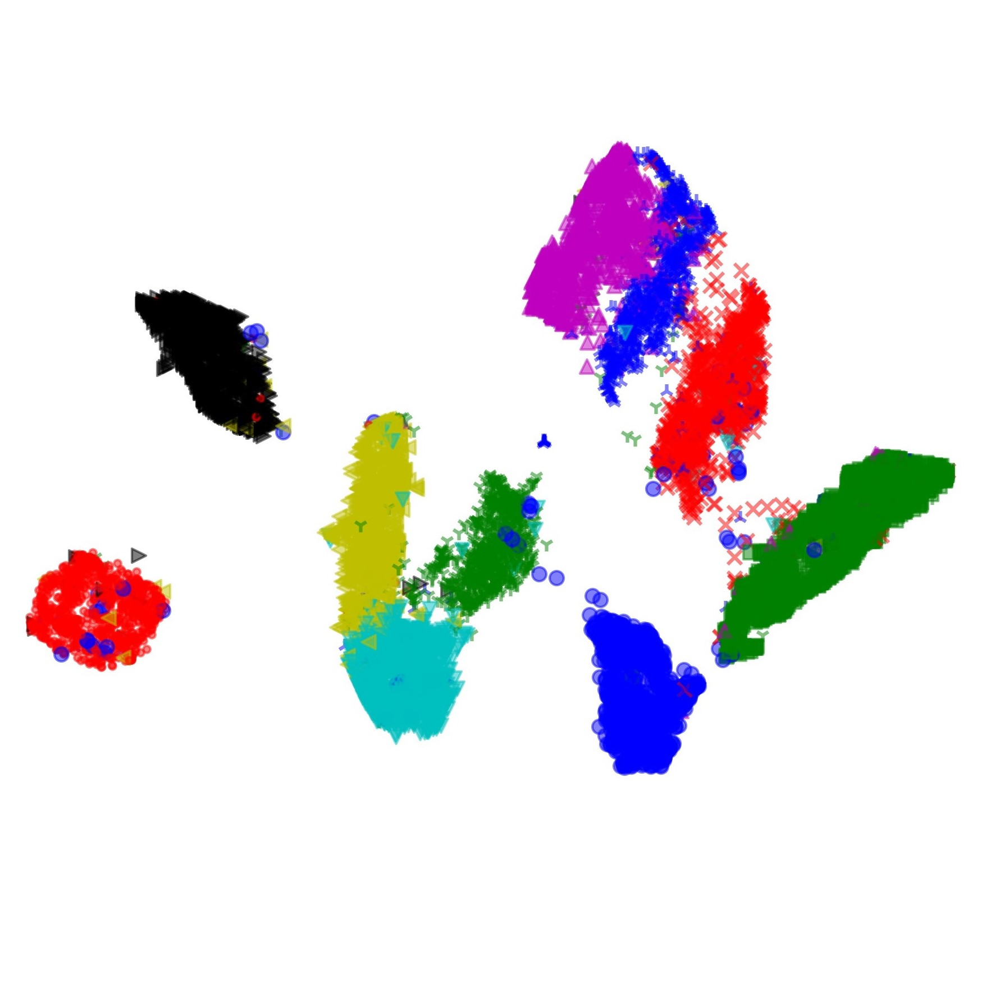

# 2-MAP
Welcome to our project  2-MAP: Aligned Visualizations for Comparison of High-Dimensional Point Sets.

**Available on Arxiv**: TODO

## Contents
- [Overview](##overview)
- [Examples](##Examples)
- [Install Dependencies](##install-dependencies)
- [Code Structure](##code-structure)
    - [Directories](##directories)
- [Usage](##Usage)
- [Reference](##Reference)

## Overview
In machine learning development pipeline, visualization of high-dimensional data is a very important tool. If you are familiar with visualization, you must know dimensionality reduction tools like t-SNE[1] and UMAP[2]. Those tools can keep high dimensional feature into 2 or 3 dimensions to give you an intuitive view of high dimensional data. However, these approaches are not well suited for comparison of multiple raelated high-dimensional representations. 

Don’t worry, 2-MAP is used for this!

2-MAP is a technology based on UMAP, which optimizes two different UMAP together with an alignment penalty error. In this case, coresponding points in different map are aligned to same place. Comparison for different algorithms or structures became easy!

Let me show some examples:
## Examples
### MNIST dataset
Firstly, Let’s play with some simple dataset. MNIST digit dataset is a perfect example. Assume we want to figure out how good of a 10-dimensional PCA result. We can just run 2-map on 10-dimensional PCA result and 784-dimensional raw data. 




With 2-MAP, it is easily to see the corresponding intra-cluster and inter-cluster relationship between them, which is helpful for evaluating the PCA result.

### CAR dataset
Yes! 2-map is very gifted at image embedding task. For shown what 2-map can do, we try to compare global pooling layer output with fully connect layer output of a Resnet-50[3] in image embedding task (trained by NPair loss[4] on CAR196[5] dataset). Here is the result on training set(up) and testing set(bottom). 


Wait… The training set is aligned and easy to compare, but the testing data seems doesn’t aligned at all.
Actually, it is how 2-map work. If two datasets are very different, 2-map doesn’t align them. Let me explain in next experiment.

### Fake dataset
Assume we have two dataset in 100 dimensions, one is composed by four Gaussian distributions, the other is a straight line in 100 dimensions. OK, those two datasets seem very different. So, what will happen if we run 2-map on them? (with different penalty degree)


As we can see, if we force them align together, they will lose their own features. So, we don’t align them if they are different. 

### Word embedding task
Same to image embedding task, 2-map also good at word embedding task. In this experiment, we compare ViCo[6] embedding feature with GloVe[7] embedding feature.


After aligning, it is easily to focus one specific area to see words in this area.


### Time sequence data
Well, 2-map also can deal with time sequence data. In this experiment, we will use 2-map to visualize image embedding training process. We training Resnet-50[3] on Car196[5] dataset by NPair loss[4]. And visualize the training process by record training vectors and testing vectors after each epochs. 


## Install Dependencies
1. For anaconda:
We provide a conda `environment.yml` file,
By this line code,
```
conda env create -f environment.yml
```
you can create a new conda environment including all dependence for 2-map.

then,
```
source activate 2-map
```
to enter this environment.

2. For other:
Package we need: 
  - matplotlib
  - numba
  - numpy
  - python=3.7.3
  - scikit-learn
  - scipy
  - umap-learn
  - jupyterlab(For experiment)

## Code Structure
* data folder: saving data which be used in our experiment
* exp folder: have some jupyter shell which is our experiment, and can be runned. The result will be store in exp_result folder in ./exp folder.
* utils: our 2-map package and some drawing function.

## Usage

For re-run our experiment, run .ipynb scipt on jupyter notebook(or jupyter lab) in exp folder.

- MNIST: It is umap experiment on MNIST dataset, for figure 1 & 2 in paper.
- fake_data: It is umap experiment on a fake dataset, a straight line in 100-dimension with four Gaussian disturbution
- FC_GAP: It is umap experiment on CAR dataset(trained on Res-50 with NPair loss), FC layer output vector with global pooling layer vector.
- ViCo_Glove: It is umap experiment in word embedding task, GloVe word vector with ViCo word vector.
- Training_process: It is umap experiment for time sequence vector, on CAR dataset(trained on Res-50 with NPair loss), for vectors after each epoch. 

The result will be shown in exp/exp_result/

## Reference

[1]: Maaten, L. V. D., & Hinton, G. (2008). Visualizing data using t-SNE. Journal of machine learning research, 9(Nov), 2579-2605.

[2]: McInnes, L., Healy, J., & Melville, J. (2018). Umap: Uniform manifold approximation and projection for dimension reduction. arXiv preprint arXiv:1802.03426.

[3]: He, K., Zhang, X., Ren, S., & Sun, J. (2016). Deep residual learning for image recognition. In Proceedings of the IEEE conference on computer vision and pattern recognition (pp. 770-778).

[4]: Sohn, K. (2016). Improved deep metric learning with multi-class n-pair loss objective. In Advances in Neural Information Processing Systems (pp. 1857-1865).

[5]: Krause, J., Stark, M., Deng, J., & Fei-Fei, L. (2013). 3d object representations for fine-grained categorization. In Proceedings of the IEEE International Conference on Computer Vision Workshops (pp. 554-561).

[6]: Gupta, T., Schwing, A., & Hoiem, D. (2019). ViCo: Word Embeddings from Visual Co-occurrences. In Proceedings of the IEEE International Conference on Computer Vision (pp. 7425-7434).

[7]: Pennington, J., Socher, R., & Manning, C. (2014, October). Glove: Global vectors for word representation. In Proceedings of the 2014 conference on empirical methods in natural language processing (EMNLP) (pp. 1532-1543).

